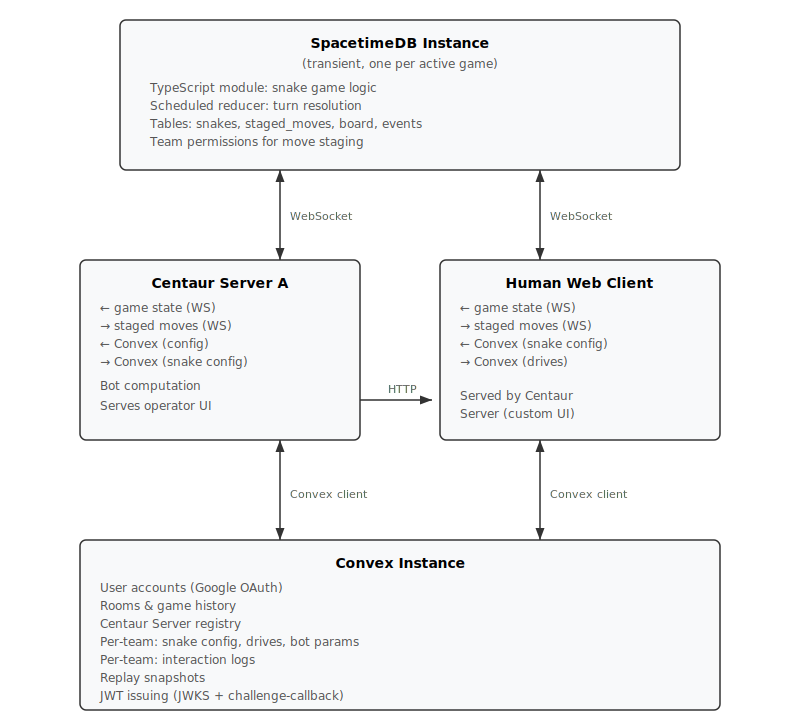

# Team Snek Centaur Platform — Integrated Specification v2.2

## 1. Vision

Team Snek is a team-based multiplayer snake game that serves as the first title on the Centaur educational platform. The platform trains players to collaborate with AI by giving each team a Centaur Server — a bot infrastructure that controls all the team's snakes by default, with human operators overriding individual snakes when their judgment adds marginal value.

The platform comprises three layers:

- **Game Engine**: A SpacetimeDB module (TypeScript) running Team Snek game logic. One transient SpacetimeDB instance per active game. Turn resolution is simultaneous and runs as a single ACID transaction. Turn advancement uses a chess-timer system with per-team time budgets.
- **Platform Services**: A single Convex instance managing user accounts, rooms, game history, replays, game configuration, Centaur Server registration, and per-team Centaur state (snake config, bot parameters, interaction logs).
- **Centaur Servers**: Per-team servers that subscribe to game state via WebSocket, run bot computation, stage moves, and serve the operator UI to human teammates. Each team's Centaur Server authenticates to SpacetimeDB as a single connection controlling all the team's snakes. Every team must have a registered Centaur Server — there are no pure-human teams.

---

## 2. Platform Architecture

### Infrastructure Topology



### Shared Engine Codebase

The game engine is a single TypeScript codebase shared across the SpacetimeDB module, Centaur Server library, and web client. It exports:

- **Game state types**: Snake, Board, Food, Potion, Cell, Direction
- **Turn resolution logic**: Collision detection, food/potion processing, scoring — used authoritatively by SpacetimeDB, used for simulation by Centaur Server bots
- **Move validation**: Used by clients for pre-validation and SpacetimeDB for authoritative validation

### SpacetimeDB (Game Runtime)

Each game is a transient SpacetimeDB instance. The TypeScript module is deployed as a SpacetimeDB module. A scheduled reducer fires at the configured turn interval, reads all staged moves, runs the full turn resolution pipeline as a single ACID transaction, and writes results back.

SpacetimeDB provides automatic real-time synchronization to all connected clients via subscription queries. Team Snek has full board visibility by default, with the exception of **invisible snakes** — snakes under an invisibility buff are filtered from opponent team connections via Row Level Security. All game mechanics apply to invisible snakes normally; invisibility is purely an information asymmetry.

**Move staging**: The `staged_moves` table is keyed by snake ID. Exactly one staged move exists per snake at any time. Writes use last-write-wins semantics. Both human web clients (for direct overrides) and Centaur Servers (for bot-computed moves) write to this table. The turn resolver consumes and clears staged moves atomically when the turn fires.

**Replay persistence**: Game state is stored as an append-only log within SpacetimeDB (see Section 10). At game end, Convex reads the complete log to construct the replay. No per-turn posting is required during gameplay.

### Convex (Unified Platform)

A single Convex instance manages all persistent state:

**Platform-wide:**
- User accounts (Google OAuth identity, profile data)
- Rooms (persistent lobbies hosting sequential games)
- Game history (results, scores, statistics)
- Replay data (complete game logs imported from SpacetimeDB at game end)
- Centaur Server registry (domain, team association, health status)
- Game configuration (board size, turn time, food rates, potion settings)
- JWT infrastructure (RSA key pair for Centaur Server auth, JWKS endpoint)

**Per-team Centaur state:**
- Snake config (per-snake: selection state, manual mode, temperature, live stateMap, worst-case worlds, annotations, heuristic outputs)
- Active Drives per snake (type, target, weight — editable by the snake's current selector)
- Bot parameters (global temperature, operator mode, time allocations)
- Interaction logs (`centaur_action_log` — high-resolution time series of all human and bot actions for training replay)

### Centaur Servers (Per-Team)

Each team operates its own Centaur Server, built on a provided library. The Centaur Server:

- Authenticates to SpacetimeDB via a Convex-issued JWT (obtained through challenge-callback, see Section 3)
- Holds a WebSocket subscription to SpacetimeDB for live game state
- Runs bot computation for all team snakes not currently human-selected
- Stages computed moves in SpacetimeDB's `staged_moves` table
- Subscribes to Convex for snake config, drive assignments, bot parameters
- Writes snake config updates (stateMap, worst-case worlds, annotations, heuristic outputs) and action log entries to Convex
- Serves the operator UI (web application) to human teammates, including team-perspective replay mode for completed games

**Centaur Server Library**: Provides the bot framework (Drives, Preferences, anytime evaluation, softmax decision), the challenge-callback auth handler, a `/healthcheck` endpoint, Convex schema bindings, and a reference operator UI. The platform calls `/healthcheck` when a Centaur Server is added to a game; a ping button in the room config UI allows manual wake-up checks. Teams plug in custom Drives and Preferences and may modify the operator UI. The Convex interaction layer is opinionated — it enforces invariants such as at most one selector per snake and at most one snake per selector, and exposes Drive management only to the current selector of a snake.

### Web Clients

Human operators connect to their team's Centaur Server web application. The client connects to:

1. **SpacetimeDB** (direct WebSocket, low latency): Subscribes to game state. Stages direct moves for human-controlled snakes. Authenticates via Convex-issued admission ticket (see Section 3).

2. **Convex** (standard Convex client): Reads snake config (selection, stateMap, worst-case worlds, annotations, heuristic outputs), drive assignments. Writes Drive assignments, weight overrides, selection changes, move staging. All player actions are logged to `centaur_action_log`.

---

## 3. Authentication & Authorization

### Identity Model

Three identity types in the system:

1. **Human users**: Google OAuth accounts, authenticated via Convex Auth. Identified by email address.
2. **Centaur Servers**: Identified by registered domain. Authenticated via challenge-callback protocol.
3. **SpacetimeDB game participants**: Both humans and Centaur Servers receive Convex-issued JWTs (admission tickets) that SpacetimeDB validates against a shared HMAC secret.

### Centaur Server Authentication (Challenge-Callback)

No shared secrets are stored or exchanged at registration time. A Captain registers their Centaur Server by entering its domain URL on the platform.

**Auth flow (initiated by Centaur Server, repeated on JWT expiry):**

1. Centaur Server calls unauthenticated Convex HTTP action: `POST /api/centaur-auth` with `{domain: "team-foo.example.com"}`
2. Convex looks up the registered Centaur Server for that domain, generates a cryptographic nonce
3. Convex POSTs the nonce to `https://team-foo.example.com/.well-known/centaur-challenge`
4. The Centaur Server at that domain echoes the nonce back in the HTTP response
5. Convex signs a JWT (`sub: "centaur:{teamId}"`, short expiry) using the platform's RSA private key, returns it to the caller
6. Centaur Server uses this JWT with the standard Convex client

The Centaur Server library provides the `/.well-known/centaur-challenge` endpoint handler and an automatic token refresh loop.

**Convex JWT infrastructure**: An RSA key pair is stored in Convex environment variables. A Convex HTTP action at `/api/jwks` serves the public key in JWKS format. The `auth.config.ts` configures a `customJwt` provider pointing at this JWKS endpoint. The `sub` claim prefix (`centaur:` vs Google OAuth subjects) distinguishes Centaur Server identities from human identities in `ctx.auth.getUserIdentity()`.

### Human Authentication

Human users authenticate with Google OAuth via Convex Auth on the platform. This establishes a persistent Convex session (token in browser localStorage).

### SpacetimeDB Admission Tickets

When a game starts, Convex seeds the SpacetimeDB instance with:
- Game configuration
- Team membership (mapping team IDs to authorized email addresses and Centaur Server team IDs)
- An HMAC secret for ticket validation

Participants obtain admission tickets from Convex:
- **Humans**: Call a Convex mutation `getAdmissionTicket(gameId)` — Convex validates their session, checks team membership, returns an HMAC-signed JWT containing `{email, teamId, gameId, role: "human", exp}`
- **Centaur Servers**: Call the same endpoint, authenticated as their Centaur identity — returns a ticket with `{teamId, gameId, role: "centaur", exp}`

The client sends the admission ticket over the SpacetimeDB WebSocket via a `register` reducer. The SpacetimeDB module validates the HMAC signature and associates that connection's Identity with the appropriate team and permission level.

**Move staging permissions**: Both human connections and the Centaur Server connection for a team can stage moves for any snake belonging to that team. Last-write-wins. Selection discipline is enforced by the Centaur Server library's opinionated Convex API, not by SpacetimeDB.

---

## 4. Game Rules

### 4.1 Board

The board is a rectangular grid. The inner area (excluding a 1-cell-thick impassable wall border) is the playable space.

| Label | Total Grid | Playable Area |
|-------|-----------|---------------|
| Small | 11×11 | 9×9 |
| Medium | 13×13 | 11×11 |
| Large | 17×17 | 15×15 |
| Giant | 21×21 | 19×19 |

Cell types: **Normal**, **Wall** (impassable border), **Hazard** (deals configurable damage on entry), **Fertile** (food spawns here when fertile ground is enabled).

### 4.2 Snakes

Each snake is an ordered sequence of cells (head first, tail last). Snakes are automatically named by their team and a consecutive letter: e.g. in a 2-team game with 5 snakes per team, the snakes are Red.A through Red.E and Blue.A through Blue.E. The letter is displayed at the snake's head cell.

State per snake:

- **Body**: Ordered list of cell positions
- **Health**: Integer, starts at MaxHealth (configurable, default 100)
- **Invulnerability level**: Integer, starts at 0. Positive = buffed, negative = vulnerable
- **Active effects**: List of `{type: invuln_buff | invuln_debuff | invis_buff | invis_collector, expiryTurn: number}` entries
- **Last direction**: The direction moved on the previous turn (used as fallback)
- **Alive/dead status**
- **Visible**: Boolean. False when under invisibility buff effect. Invisible snakes are hidden from opponent views.

At game start, every snake has length 3 with all three segments stacked on the same starting cell.

### 4.3 Items

**Food**: Occupies a cell. When a snake's head enters the cell, the food is consumed: the snake grows by one segment (tail duplicated next turn) and health is restored to MaxHealth.

**(In)vulnerability Potion**: Occupies a cell. When a snake's head enters the cell, the collector receives an invulnerability debuff (level −1, 3 turns) and all alive teammates receive an invulnerability buff (level +1, 3 turns).

**Invisibility Potion**: Occupies a cell. When a snake's head enters the cell, all alive teammates become invisible to opponent teams for 3 turns. The collector bears the standard potion-collector risk: any interaction (see Section 4.8) they suffer during the effect duration cancels the invisibility for all teammates. Invisible snakes are hidden from opponent team views at the SpacetimeDB RLS level via Row Level Security on the `snake_states` table, cross-referencing the `visible` flag and the querying connection's team membership. All game mechanics (collisions, severing, head-to-head) apply to invisible snakes normally on the server; invisibility is purely an information asymmetry.

**MVP bot behavior for invisibility**: Bot code naively simulates next board states with only the invisibility potion collector as the opponent. More intelligent detection of invisible snakes (e.g. inferring positions from last known location at earlier turns) is left as an exercise for coaches to implement in their Centaur Servers.

**Hazard cell coexistence**: Hazard cells can simultaneously contain a food item or a potion. Spawning rules (Section 4.5, Phase 7, Phase 8) exclude hazard cells as spawn targets, so items do not land on hazard cells during normal spawning. However, items may occupy hazard cells if configuration or future rule changes alter spawning eligibility, and the coexistence case is valid game state. When a snake's head enters a hazard cell that also contains food or a potion, both the hazard effect and the item effect are applied in the same turn (5b before 5c, or per Phase 6 for potions).

### 4.4 Starting Positions

The board is divided into approximately equal contiguous regions per team by overlaying a circular pie centred on the board, divided into N equal angular segments for an N-team game. Each playable cell is assigned to the segment it overlaps most with (ties broken randomly). The angular offset of the pie is randomised each game.

Snakes are then distributed randomly across unblocked cells (non-wall, non-hazard) within their team's starting territory.

**Parity constraint**: All snake heads must be placed on cells of the same parity (i.e. cells where `(x + y) % 2` is the same value), equivalent to placing all heads on the same colour of a chessboard. This ensures any two snakes can potentially collide head-to-head — without parity alignment, snakes on opposite parities can never occupy the same cell on the same turn.

### 4.5 Initial Items

After all snake starting positions are chosen, one food item per snake on the board is spawned randomly across eligible free cells (non-wall, non-hazard, non-snake, and fertile if fertile ground is enabled).

### 4.6 Hazards

If hazard percentage > 0: `floor(free_cells × hazard_percentage / 100)` random inner cells become hazards. Entering a hazard cell deals configurable damage (default 15) to the snake's health each turn the head remains on it. Hazard placement guarantees that all non-hazard, non-wall inner cells form a single connected region.

### 4.7 Fertile Tiles

If fertile ground is enabled, a subset of inner non-wall, non-hazard cells are designated fertile at game start. These tiles are static throughout the game. When fertile ground is active, all mid-game food spawns exclusively on fertile tiles.

**Procedural generation via Perlin noise:**

1. **Candidate pool**: All inner board cells excluding wall perimeter and hazard tiles are eligible.
2. **Random seed**: A random 2D offset is chosen each generation, ensuring different layouts each game.
3. **Fractal Perlin noise**: Each candidate cell is scored using 4-octave fractal Perlin noise. Each successive octave doubles the frequency and halves the amplitude, adding fine detail on top of coarse structure.
4. **Clustering parameter controls frequency**: The base frequency is mapped from the clustering slider (1–20) such that low clustering → high base frequency → small scattered patches; high clustering → low base frequency → large contiguous blobs.
5. **Density parameter controls coverage**: Cells are sorted descending by their noise score, and the top N% are selected as fertile, where N is the density setting (clamped 1–90%).

The result is a spatially coherent set of tiles that looks organic — blobs at high clustering, scattered flecks at low clustering — with the density knob independently controlling total area coverage.

### 4.8 Interactions

An **interaction** is any of the following events experienced by a snake during turn resolution:
- **Death** (any cause: collision, starvation, severing)
- **Severing** another snake's body
- **Being severed** by another snake
- **Receiving a body collision**: a foreign snake's head enters a cell occupied by this snake's body, killing the collider
- **Entering a hazard cell**
- **Eating food**
- **Collecting any item** (including potions)

Any potion collector that suffers an interaction before the effect of that potion expires will cancel the potion's effect for all affected teammates, including removing the collector's own `invuln_debuff` or `invis_collector` status. This applies uniformly to all potion types — both (in)vulnerability and invisibility.

---

## 5. Turn Resolution Pipeline

### Turn Timing: Chess Timer System

Each team has a **time budget** that depletes while that team's turn clock is running. The turn proceeds as follows:

1. The turn begins. Each team's clock starts at `min(maxTurnTime, remainingBudget)`.
2. A team's clock stops when that team **declares turn over** — either explicitly via a SpacetimeDB reducer call (from the Centaur Server's automatic submission or the timekeeper's manual override), or implicitly when the clock runs out. Turn declaration is a direct SpacetimeDB call, not mediated by Convex — Convex handles configuration actions that span turns, not real-time actions within a turn.
3. The turn resolves when all teams have declared turn over (or exhausted their clocks).

**Time budget mechanics:**
- Each team starts the game with a configured **initial time budget**.
- Each turn, **budget increment** (default 500ms) is added to each team's budget before the turn begins.
- Declaring turn over early saves the remaining clock time back into the budget. A team that consistently responds in less than the budget increment accumulates surplus time for later use.
- When a team's budget reaches zero, their clock for each subsequent turn is exactly the budget increment (500ms at default), which is sufficient for automated play but leaves no margin for human deliberation.
- **Max turn time** (default 10s) caps the per-turn clock regardless of budget.
- **First turn time** (default 60s) overrides the max turn time for turn 0 only.

**Turn expiry during interactions**: When a team's clock expires, SpacetimeDB resolves the turn with whatever is currently staged. All client UI interactions are reactively generated from current game state and refresh automatically on turn progression — a turn advancing mid-interaction simply refreshes the UI to the new turn. The timekeeper override is available on all turns including turn 0.

**Centaur Server affordances:**
- The Centaur Server library exposes a `declareTurnOver()` function that stops the team's clock and triggers turn resolution (if all teams are done).
- **Operator mode** (Centaur or Automatic) determines when `declareTurnOver()` is called — see Section 7.2 for details.
- A **timekeeper** role (assigned to a team member by the Captain) has shortcut keys to toggle operator mode and to immediately submit the turn.

### Effect Immutability Principle

**All buff/debuff status is frozen at the start of turn resolution.** Invulnerability levels, invisibility status, and all other effect states used during collision detection and interaction processing reflect the state that players observed when making their moves. Effects gained or lost during the current turn's resolution take effect at the start of the *next* turn.

This means:
- A snake that collects a potion this turn does not gain/lose invulnerability during this turn's collision checks.
- A vulnerable snake that dies this turn triggers ally buff cancellation, but that cancellation takes effect next turn, not retroactively within this turn.
- Invisibility gained this turn takes effect next turn.

### Phase 1: Move Collection

For each alive snake, read the staged move from `staged_moves`. If no move is staged:

- **Turn 0** (no `lastDirection` exists): the snake moves to the first available non-lethal adjacent cell, using deterministic tie-breaking by priority: Up → Right → Down → Left.
- **All subsequent turns**: the snake continues unconditionally in `lastDirection`, even if that cell is lethal. The deterministic fallback is not applied.

### Phase 2: Snake Movement

Each snake's head advances one cell in the chosen direction. The tail segment is removed. Exception: if the snake ate food on the immediately preceding turn, the tail is retained (growth).

### Phase 3: Collision Detection

After all snakes have moved, evaluate collisions simultaneously:

- **Wall collision**: Head enters a wall cell → snake dies
- **Self-collision**: Head enters a cell occupied by the snake's own body → snake dies
- **Body collision**: Head enters a cell occupied by another snake's body. Modified by invulnerability:
  - If attacker's invulnerability level > body owner's level: **sever** — segments from contact point to tail are removed from the body owner. Attacker survives.
  - Otherwise: attacker dies.
- **Head-to-head collision**: Two or more heads on the same cell. Modified by invulnerability:
  - Snakes with a lower invulnerability level die.
  - Among snakes with the highest invulnerability level: shorter snakes die. If equal length, all die.

### Phase 4: Pending Effect Changes from Collisions

Record all effect changes triggered by collision outcomes, to be applied in Phase 10:
- When a vulnerable snake (invulnerability level < 0, per frozen state) dies in Phase 3: schedule cancellation of all invulnerability buffs on their alive teammates.
- When a potion collector suffers any interaction in Phase 3 (see Section 4.8): schedule cancellation of that potion's effects on their teammates and removal of the collector's own `invuln_debuff` or `invis_collector` status.

### Phase 5: Health, Hazards, and Food

For each surviving snake, apply the following in order. All health modifications are calculated before any starvation deaths are evaluated.

**5a. Health tick**: Subtract 1 health from every surviving snake (starvation pressure, applied unconditionally).

**5b. Hazard damage**: If a snake's head occupies a hazard cell, subtract **hazard damage** (configurable, default 15) from its health. This is independent of and additive with the health tick. Entering a hazard is an interaction (see Section 4.8) — if the snake is a potion collector, schedule cancellation of that potion's effects on teammates and removal of the collector's own `invuln_debuff` or `invis_collector` status.

**5c. Food consumption**: If a snake's head occupies a food cell, consume the food: the snake grows (tail duplicated next movement) and health is restored to MaxHealth. Eating food is an interaction — if the snake is a potion collector, schedule cancellation of that potion's effects on teammates and removal of the collector's own `invuln_debuff` or `invis_collector` status. A snake on a hazard cell containing food receives the hazard damage first, then the food healing (net: MaxHealth).

**5d. Starvation death**: After all health modifications are applied, any snake with health ≤ 0 dies of starvation. If the starving snake was vulnerable, schedule ally buff cancellation. If the starving snake was a potion collector, schedule cancellation of that potion's effects on teammates and removal of the collector's own `invuln_debuff` or `invis_collector` status (death is an interaction).

### Phase 6: Potion Collection

If potions are enabled, for each surviving snake whose head occupies a potion cell:

**(In)vulnerability potion:**
- Schedule: collector receives `invuln_debuff` (level −1, expires in 3 turns) starting next turn
- Schedule: all alive teammates receive `invuln_buff` (level +1, expires in 3 turns) starting next turn
- Potion is consumed

**Invisibility potion:**
- Schedule: collector receives `invis_collector` status (3 turns) starting next turn
- Schedule: all alive teammates receive `invis_buff` (invisible, 3 turns) starting next turn
- Potion is consumed

Collecting a potion is an interaction (see Section 4.8). If the collector is already a potion collector from a previous turn, this collection triggers cancellation of the earlier potion's effects on teammates and removes the collector's own `invuln_debuff` or `invis_collector` from that earlier potion.

### Phase 7: Food Spawning

Spawn food on free cells (not walls, snakes, hazards, existing food, potions). Expected count = configured food spawn rate. Integer part guaranteed; fractional part = probability of one additional. If fertile ground active, candidate cells restricted to fertile tiles. Randomness seeded from turn seed. Note: hazard cells are excluded as *spawn targets*, but a hazard cell that already contains food (e.g. placed by a prior rule change) remains valid game state — see Section 4.3 for coexistence semantics.

### Phase 8: Potion Spawning

If potions enabled, (in)vulnerability potions and invisibility potions each spawn independently using their respective configured spawn rates, by the same probabilistic mechanism as food.

### Phase 9: Effect Application and Expiry

1. Apply all pending effect changes scheduled during Phases 4–6 (buff cancellations, new potion effects). These become active for subsequent turns.
2. Remove all effects whose expiry turn has been reached.
3. Recalculate each snake's invulnerability level and visibility status from remaining active effects.

### Phase 10: Win Condition Check

- **Last team standing**: If all snakes of every team but one are dead, that team wins.
- **Simultaneous elimination**: If all remaining snakes die the same turn, winner determined from the *previous turn's* state: team with highest combined snake length wins. **Turn-0 edge case**: if simultaneous elimination occurs on turn 0, there is no preceding turn; scores are computed from initial snake lengths at game start (length 3 per snake).
- **Turn limit**: If max turns reached, team with highest combined alive snake length wins. Tied teams draw.

### Phase 11: Event Emission

Emit turn events (deaths with cause, food eaten, potions collected, spawns, effect changes) to the `turn_events` table. Append new `snake_states` rows and update `item_lifetimes` for consumed/spawned items.

---

## 6. Bot Framework

The bot framework ships as part of the Centaur Server library. Teams plug in custom Drives and Preferences but the evaluation, simulation, and submission infrastructure is provided.

**Scope**: The MVP bot framework operates at depth-1 (single-ply lookahead). Multi-ply tree search is a future enhancement.

### 6.1 Heuristic Types

**Drive\<T\>**

A directed motivation toward or away from a future event, parameterised by a target:

```typescript
interface Drive<T> {
  target: T;
  eligibleTargets: (candidate: T, self: SnakeState, board: BoardState) => boolean;
  rewardFunc: (self: SnakeState, target: T, board: BoardState) => number;   // [-1, 1]
  distanceFunc: (self: SnakeState, target: T, board: BoardState) => number; // non-negative
  motivationFunc: (reward: number, distance: number) => number;            // [-1, 1]
  satisfiedPredicate: (self: SnakeState, target: T, board: BoardState) => boolean;
  nominateSelfDirections: (self: SnakeState, target: T, board: BoardState) => Direction[];
  nominateForeignMoves: (self: SnakeState, target: T, board: BoardState) => Array<{ snakeId: SnakeId; direction: Direction }>;
}
```

When `satisfiedPredicate` returns true in a simulated board state, the Drive is considered achieved: `rewardFunc` is evaluated one final time to produce the terminal reward, which is applied directly (bypassing `motivationFunc` and distance dampening). In the bot's live portfolio, a satisfied Drive is removed after the turn in which satisfaction is detected.

**Drive target types**: In Team Snek, the type parameter `T` of a Drive is constrained to one of two types:
- **Snake**: A reference to a specific snake on the board (by snake ID).
- **Cell**: A reference to a specific board cell (by coordinates).

Semantic variants:
- **Goal**: A Drive where `rewardFunc` returns positive values — motivates approach.
- **Fear**: A Drive where `rewardFunc` returns negative values — motivates avoidance.

The distinction is purely semantic. The framework treats all Drives identically.

**Preference**

A time-invariant heuristic over board state:

```typescript
type Preference = (self: SnakeState, board: BoardState) => number; // [-1, 1]
```

### 6.2 Output Range Convention

All heuristic functions output values in [-1, 1]. Calibration is concentrated in portfolio weights.

### 6.3 Motivation Function Convention

`motivationFunc` dampens reward asymptotically toward 0 as distance grows. Standard constructors:
- **Exponential**: `(reward, distance) => reward * λ^distance` where λ ∈ (0, 1)
- **Hyperbolic**: `(reward, distance) => reward / (1 + k * distance)` where k > 0

### 6.4 Heuristic Configuration and Snake Portfolios

Each Centaur Server maintains a **global heuristic configuration** — a persistent table stored in Convex and editable by any team member via the Heuristic Config page in the Centaur Server web application (see Section 7.1). This table defines:

- **Per Preference**: whether it is active on new snakes by default, and its default portfolio weight.
- **Per Drive type**: its default portfolio weight, and its position in the ordered Drive dropdown list that appears when an operator adds a Drive to a selected snake.

When a game begins, each snake's portfolio is initialised from these global defaults: all default-active Preferences are included with their default weights. No Drives are active by default — Drives are added per-snake at runtime by operators selecting from the configured dropdown.

An operator who has selected a snake can edit that snake's portfolio live during the game: adjust weights on any active Drive or Preference, add Drives from the dropdown, or remove Drives. These per-snake overrides persist across turns but do not modify the global defaults.

### 6.5 Candidate Direction Enumeration

For each snake, there are at most 4 candidate directions (up, down, left, right). Immediately lethal directions (wall, self-body) may be pruned but are retained as last-resort options if all directions are lethal.

### 6.6 World Simulation and Game Tree Cache

For each candidate self-direction, the bot simulates partial next-turn board states by combining the self-move with foreign snake moves. Simulated worlds are stored in an append-only **game tree cache** per snake. Branches are never discarded within a turn — they are toggled between **active** and **dormant** states as inputs change. When fresh board state arrives for the next turn, the game tree cache is cleared and computation starts over. (In a future multi-ply implementation, branches inconsistent with the observed new board state would be pruned while retaining deeper speculation that remains valid. For this single-ply MVP, a full reset each turn is simpler and sufficient.)

**Three reactive inputs determine which cached branches are active:**

1. **Interest map**: The union of all active Drives' `nominateForeignMoves` outputs. For each foreign snake Y, this produces a set of directions X's heuristics care about. Adding, removing, or retargeting a Drive mutates this map. If Y has no nominations from any Drive, Y is absent from the lattice entirely regardless of its commitment state.

2. **Commitment state**: For each foreign snake Y, either `null` (automatic mode) or a specific committed direction (manual mode).

3. **Portfolio weights**: Scalars applied to normalized heuristic outputs. These affect scoring but not tree structure — weight changes never activate, deactivate, or queue branches.

**A cached branch involving snake Y moving direction D is active iff:**
- D is in the interest map for Y (at least one Drive nominated this move), **AND**
- Y's commitment is null (automatic) OR Y's commitment == D

**Consequences:**
- If Y is committed to a direction not in the interest map, Y drops out of the lattice — it contributes no dimension and is held at its current position.
- If Y is in automatic mode, all nominated directions for Y are active. Only nominated directions — not all four.
- If Y's commitment changes, branches toggle between active and dormant instantly. If the new commitment corresponds to uncomputed branches, those are queued for computation.
- If Y's commitment reverts to a previous value, previously dormant branches reactivate with no recomputation.

**Priority weights**: Each (snake, direction) pair receives a priority weight computed as the sum over all nominating Drives of `portfolioWeight × RANK_DECAY^(rank-1)` where `RANK_DECAY = 0.9`. Priority weights are reactively recomputed when Drives are added, removed, or have their portfolio weights changed. The Dijkstra traversal proceeds over uncomputed-but-active branches in descending combined priority weight. Already-computed branches are unaffected by priority changes.

**Foreign combination traversal (Dijkstra-on-lattice)**: Each dimension of the lattice corresponds to one foreign snake present in the interest map with at least one active direction. Combined weight = product of per-snake weights at the chosen rank.

1. Initialize max-heap with the all-rank-0 point (every foreign snake at its highest-weight active direction)
2. Pop highest-weight point; simulate the corresponding world (apply all moves, run full turn resolution using shared engine code); store in game tree cache
3. Push all unvisited neighbours into the heap. A neighbour is formed by incrementing exactly one dimension's rank index by 1; dimensions whose rank would exceed their number of active directions minus 1 are not incremented.
4. Repeat until heap empty or compute budget exhausted

### 6.7 Scoring

Each cached world simulation stores **normalized heuristic outputs** — the raw [-1, 1] values from each Drive's `rewardFunc`/`distanceFunc`/`motivationFunc` (or terminal reward if `satisfiedPredicate` is true) and each Preference function. Portfolio weights are applied as a final step on top of these cached normalized outputs.

For each candidate self-direction, the **stateMap** entry is the worst-case weighted score across all **active** branches:

1. For each active cached world: compute the weighted sum by applying current portfolio weights to cached normalized outputs. Each Drive contributes `portfolioWeight × cachedMotivation` (or `portfolioWeight × cachedTerminalReward` if satisfied). Each Preference contributes `portfolioWeight × cachedPreferenceValue`.
2. Worst-case score = minimum weighted sum across all active branches for this self-direction.

This means **portfolio weight changes are cheap** — they rescan cached outputs without re-simulating any worlds. Only the weighted aggregation and min-scan are recomputed. The stateMap is marked dirty if the result changes.

Conservative minimax: the bot favours directions that maximise the worst-case outcome.

### 6.8 Anytime Submission

Each snake maintains a `stateMap` of directions to worst-case scores, a dirty flag, and a game tree cache.

**Compute allocation**: Automatic-mode snakes receive continuous scheduled compute. Currently-selected manual-mode snakes are computed with high priority (see Section 6.10). Unselected manual-mode snakes are scheduled at the end of the queue — they receive compute only after all automatic and selected-manual snakes have been served, proactively preparing their stateMap for potential reselection.

**Round-robin processing**: Compute is distributed round-robin across snakes (within each priority tier) and round-robin across self-directions within each snake, so every snake and every direction receives its highest-priority foreign world before any receives its second.

**Reactive stateMap updates**: Any change to the three reactive inputs (interest map, commitment state, portfolio weights) triggers a stateMap recalculation from the game tree cache. This is a cheap scan over cached data — no re-simulation. If the stateMap changes, the dirty flag is set.

**Scheduled submission**: A submission process runs on a fixed 100ms interval. For each automatic-mode snake with a dirty stateMap, it samples the softmax over current worst-case scores and stages the resulting direction in SpacetimeDB. Dirty flag cleared after submission. Manual-mode snakes are never staged by the submission process.

**Final submission**: One last submission immediately before the turn deadline flushes all dirty automatic-mode snakes.

### 6.9 Softmax Decision

```
P(direction_i) = exp(score_i / T) / Σ exp(score_j / T)
```

Global temperature T set at Centaur Server level. Per-snake temperature override available. Lower T = more deterministic; higher T = more exploratory.

### 6.10 Human-Selection Resume

When a human selects a snake, its computation is promoted to high priority:

1. The cache is checked against current reactive inputs — any commitment changes or interest map changes since the cache was last computed at high priority toggle branches between active and dormant, and queue any uncomputed-but-active branches. (The cache may already be partially updated from low-priority background compute.)
2. The stateMap is recalculated from active branches. If changed, updated scores are displayed immediately.
3. Computation of queued branches continues with high priority.

If the snake already has a human-staged move, that move remains staged. Updated scores are displayed but no softmax roll occurs. The human sees exactly the same heuristic information the bot would act on, updated for any changes that occurred while the snake was unselected.

---

## 7. Centaur Server Web Application

The Centaur Server serves a multi-page web application to its team's human operators. This is the team's primary interface for configuring AI behavior, playing live games, and reviewing past games. The Game Platform (Section 8) handles team identity, room management, and cross-team concerns; the Centaur Server web application handles everything internal to a team's competitive operation.

All pages authenticate via Google OAuth (the same identity used on the Game Platform). Navigation provides access to: live game (when one is active), game history (completed games available for team replay), heuristic configuration, bot parameters, and a link back to the Game Platform.

The Centaur Server library provides a reference implementation of the full web application; teams may customise the UI.

### 7.1 Heuristic Config

A persistent configuration page listing all Drives and Preferences registered by the Centaur Server. Editable by any team member. This table defines:

- **Per Preference**: whether it is active on new snakes by default, and its default portfolio weight.
- **Per Drive type**: its default portfolio weight, and its position in the ordered Drive dropdown list that appears when an operator adds a Drive to a selected snake.

Changes here set defaults for future games — they do not retroactively modify in-progress games. See Section 6.4 for how these defaults initialise snake portfolios at game start.

### 7.2 Bot Parameters

A persistent configuration page for team-wide bot settings. Editable by any team member. Configures:

- **Global temperature**: Softmax temperature for bot move selection (see Section 6.9).
- **Default operator mode**: Centaur or Automatic (see Section 7.6 for mode semantics).
- **Automatic time allocation**: Maximum compute time before auto-submitting in Automatic mode.
- **Turn-0 automatic time allocation**: Separate allocation for turn 0, which typically has a longer max turn time.

These are stored in Convex per team and read by the Centaur Server at game start.

### 7.3 Game History and Team Replay

Lists completed games the logged-in user participated in, showing room name, date, opponent teams, result, and scores. Selecting a game opens the team-perspective replay viewer (see Section 13.3), which reuses the live operator interface components in read-only mode with sub-turn timeline scrubbing.

### 7.4 Live Operator Interface — Design Principles

**Default: AI control.** All snakes are controlled by bot code by default. The Centaur Server stages moves for all automatic-mode snakes every turn.

**Selection ≠ manual override.** An operator selects a snake to view its heuristic scores, configure Drives, and adjust weights. Selection alone does not put a snake in manual mode — the snake remains in automatic mode and the bot continues staging moves for it.

**Manual mode: explicit toggle.** A "Manual" checkbox appears when a snake is selected. Checking it locks the currently staged move and removes the snake from the automatic submission pipeline. The checkbox is automatically checked if the human picks a concrete direction (via keyboard or mouse). Unchecking returns the snake to automatic mode — the bot immediately resumes staging moves for it via the normal anytime pipeline.

**Compute follows attention.** Automatic-mode snakes receive continuous scheduled compute. Currently-selected manual-mode snakes are computed with high priority. Unselected manual-mode snakes are scheduled at the end of the queue — they receive compute only after all other snakes have been served.

### 7.5 Live Operator Interface — Layout

**Header:**
- Turn number
- **Team clock**: countdown showing time remaining for this team this turn (seconds to one decimal; red when < 0.5s; shows "Turn Submitted" once declared over)
- **Time budget**: remaining team time budget
- **Operator mode indicator**: displays "CENTAUR MODE" or "AUTOMATIC MODE"
- Network ping to SpacetimeDB
- Connected operators shown as coloured dots with nicknames
- **Timekeeper controls** (visible only to the designated timekeeper):
  - Mode toggle shortcut key: switches between Centaur and Automatic mode
  - Submit shortcut key: immediately declares the team's turn over, submitting all currently staged moves

**Board display:**
- Full live board with grid lines
- Hazard cells, fertile tiles, food, potions
- All snakes with team colour fill, letter designation at head (A, B, C...), length at neck
- Blue outline for invulnerability level > 0, red outline for level < 0
- Translucent/shimmer effect for allied invisible snakes (visible to own team only)
- Selection glow in controlling operator's colour
- Move candidate highlighting: four adjacent cells coloured by bot score (green→red)
- Staged move purple border on destination cell
- **Worst-case world preview** (when a direction is selected): translucent snakes show the simulated worst-case positions for that direction; solid snakes show current positions. Voronoi territory overlay and any other team-configured annotations are computed against the worst-case world, not the current board. This preview updates as the operator selects different directions.

**Snake selection:**
- Click controlled snake body to select. Escape to deselect.
- Exclusive: at most one operator per snake, at most one snake per operator. Selecting a new snake auto-deselects the previous one. If another operator has the target snake selected, a confirmation dialog offers to displace them.

**Move interface (when snake selected):**
- **Manual checkbox**: unchecked by default (snake remains in automatic mode). Checking it locks the currently staged move. Automatically checked when the human picks a direction. Unchecking returns the snake to automatic mode immediately.
- Direction buttons (Up/Down/Left/Right) with bot scores and colour coding
- Pre-set to the currently staged direction (bot-staged or human-staged)
- Disabled for immediately lethal directions
- Arrow keys or click to **select a direction, which simultaneously stages it** as the move for this snake and triggers the worst-case world preview. Selecting a direction auto-checks Manual. Operators should be judicious about inspecting moves — each selection temporarily makes that direction the staged move, so they should only explore directions they expect to be sufficiently safe.
- Staged moves can be changed at any time before the turn deadline; there is no separate "commit" action

**Decision breakdown table:** Per-direction heuristic breakdown showing component name, raw value, weight, weighted contribution, relative impact.

**Operator mode** determines turn submission behaviour:

- **Automatic mode**: The Centaur Server runs bot computation and declares the turn over after the sooner of: clearing the compute queue, or reaching the configured **automatic mode time allocation** (see Section 7.2). Players can still select snakes, configure Drives, and stage manual moves during this window, but the automatic turn submission timer proceeds independently of their UI interactions.

- **Centaur mode**: The Centaur Server waits for the timekeeper to manually submit the turn (or for the team's clock to expire). This mode spends into the team's time budget to allow strategically significant decisions at human-scale time.

The timekeeper toggles between modes via a shortcut key. The starting mode is configured in bot parameters (Section 7.2). A separate **turn-0 automatic time allocation** parameter (also in Section 7.2) controls the automatic mode duration on turn 0, which typically has a longer max turn time from the engine.

### 7.6 Live Operator Interface — Drive Management

The operator who currently has a snake selected can add, remove, and configure Drives on that snake. Drives are added by selecting a Drive type from the dropdown (ordered per the global heuristic configuration, Section 7.1). Each Drive type declares its target type (`Snake` or `Cell`), which determines the targeting UI activated upon selection:

**Snake targeting**: The board enters snake-targeting mode. Only snakes for which `eligibleTargets` returns true are highlighted as clickable targets (e.g. smaller enemies, non-self allies). Ineligible snakes are visually dimmed. Clicking an eligible snake confirms it as the Drive's target.

**Cell targeting**: The board enters cell-targeting mode. Only cells for which `eligibleTargets` returns true are highlighted as clickable (e.g. cells containing food, cells containing potions). Ineligible cells are visually dimmed. Clicking an eligible cell confirms it as the Drive's target.

In both modes, the Drive is added to the snake's portfolio with its default weight. Pressing Tab cycles through eligible targets in order of A* distance from the snake's head (nearest first). Pressing Escape cancels targeting without adding the Drive. Active Drives are listed in the snake's control panel with their current weight (editable) and a remove button. Weight adjustments and Drive removal take effect immediately, triggering re-evaluation of the affected snake. Drive assignments and weight overrides persist across turns (they are not reset when the operator deselects the snake).

---

## 8. Game Platform Interface

The Game Platform is a Svelte web application backed by Convex. It is the primary interface for all activity outside of live gameplay — team management, room administration, game configuration, spectating, replay viewing, and player/team history. All users authenticate via Google OAuth.

### 8.1 Home and Navigation

The platform home page shows the authenticated user's Centaur Team memberships, rooms they've recently visited, and any games currently in progress. A global navigation bar provides access to: Rooms (browse/create), Teams (browse/create/manage), Profile (own player page), and Leaderboard.

### 8.2 Team Management

Any authenticated user can create a Centaur Team, becoming its Captain. The team management page (accessible to the Captain) provides:

- **Team identity**: Set team name and display colour.
- **Centaur Server registration**: Enter the server domain. The platform pings `/healthcheck` to verify reachability. Health status is displayed with last-checked timestamp.
- **Member management**: Add members by email (must have Google OAuth accounts on the platform). Remove members. Assign the timekeeper role to one member.

Any team member can view the team page. Only the Captain can modify team identity, server registration, and membership.

Bot parameters, heuristic configuration, and Drive management are Centaur Server affordances — they are configured through the the Centaur Server web application (Section 7) served by the team's Centaur Server, not through the Game Platform.

### 8.3 Room Browser and Creation

The room browser lists all rooms with name, owner, number of teams currently joined, and whether a game is in progress. Users can filter and search by name. Creating a room requires only a name; the creator becomes the room owner.

### 8.4 Room Lobby

The room lobby is the central hub for game setup. It displays current game configuration, joined teams, and ready status.

**Room owner (or anyone if no owner):**
- Edit all game configuration parameters (see Section 9.3)
- Invite or remove Centaur Teams
- Generate and lock in a board preview
- Abdicate ownership
- Start the game (enabled when ≥2 teams joined and all teams ready)

**Centaur Team participants:**
- View current configuration (read-only if owner exists and they are not the owner)
- Mark team ready / unmark ready (Captain or any team operator)
- Ping their Centaur Server's healthcheck from within the lobby

**Board preview**: A miniature rendering of the board showing approximate layout of fertile tiles, hazards, and snake starting territories given current settings. Regenerates on config changes (debounced). Can be locked in to use that exact layout for the game.

### 8.5 Live Spectating

Any authenticated user can spectate a game in progress from the platform (without joining a Centaur Team). The spectator view provides:

- Full board display with all snakes, items, hazards, and fertile tiles
- Real-time updates via SpacetimeDB subscription (spectators connect with a read-only admission ticket)
- Scoreboard showing team scores (combined alive snake lengths) and individual snake health/length
- Turn number and team clock status
- Timeline scrubber for reviewing earlier turns within the current game (enabled by the append-only SpacetimeDB schema)

Spectators cannot stage moves, select snakes, or modify any game state.

### 8.6 Replay Viewer

Completed games are viewable as replays from the platform. The replay viewer provides:

- Full board rendering identical to the spectator view
- Timeline scrubber with play/pause and speed controls (0.5×, 1×, 2×, 4×)
- Turn-by-turn event log showing deaths, food eaten, potions collected, severing events
- Per-turn scoreboard
- Direct link sharing for specific games

Replays are reconstructed from the append-only game log stored in Convex. No engine instance is required.

### 8.7 Player Profile

Each authenticated user has a profile page showing:

- Display name and email
- Centaur Team memberships (current and historical)
- Game history: a chronological list of games played, showing room name, date, team, opponent teams, result (win/loss/draw), and final scores
- Aggregate statistics: games played, win rate, average team score

### 8.8 Team Profile

Each Centaur Team has a public profile page showing:

- Team name, colour, Captain
- Current members and their roles
- Centaur Server domain and health status
- Game history: chronological list of games, showing room, date, opponents, result, and scores
- Aggregate statistics: games played, win rate, average score, head-to-head records against other teams

### 8.9 Leaderboard

A global leaderboard ranks Centaur Teams by configurable criteria:

- Win rate (minimum game count threshold to qualify)
- Total wins
- Average score

The leaderboard filters by time period (all time, last 30 days, last 7 days) and optionally by room.

---

## 9. Rooms, Lobbies, and Game Lifecycle

### 9.1 Rooms

A Room is a persistent named lobby hosted on Convex. It hosts sequential games. It has an optional **owner** with administrative control over game configuration. Ownership can be abdicated; without an owner, any participant can configure. The room owner is independent of team captains — any authenticated user can own a room.

### 9.2 Centaur Teams

A **Centaur Team** is the unit of competition. Each team has a name, display colour, and a registered Centaur Server (identified by domain). At least two Centaur Teams must join a room for a game to start.

**Joining a game**: A pre-configured Centaur Team joins or is invited to a game room. This fully specifies the team — there is no separate step for assigning individual players. The number of snakes the team fields is part of the game configuration (e.g. 3 snakes per team).

**Centaur Team management on the Game Platform** (separate from game setup): The Captain manages the team's platform-level configuration:
- Register/update the Centaur Server domain
- Add/remove human members (Google OAuth accounts) who can connect as operators
- Assign the timekeeper role to a team member

Bot parameters, heuristic configuration, and Drive management are configured through the the Centaur Server web application (Section 7), not through the Game Platform.

Human team members authenticate via Google OAuth on the platform. Their membership in a Centaur Team is a persistent platform-level association, not per-game configuration.

### 9.3 Game Configuration

| Parameter | Type | Default | Range | Notes |
|-----------|------|---------|-------|-------|
| Board size | Enum | Medium | Small/Medium/Large/Giant | |
| Max turn time | Seconds | 10 | 1–300 | Per-turn clock cap |
| First turn time | Seconds | 60 | — | Overrides max turn time for turn 0 |
| Initial time budget | Seconds | 60 | ≥0 | Starting time budget per team |
| Budget increment | Milliseconds | 500 | 100–5000 | Added to each team's budget each turn |
| Snakes per team | Integer | 3 | 1–10 | Number of snakes each Centaur Team fields |
| Max turns | Integer (opt) | Off | ≥1 | Off = last team standing only |
| Max health | Integer | 100 | ≥1 | Starting and restored health |
| Hazard % | Integer | 0 | 0–30 | |
| Hazard damage | Integer | 15 | 1–100 | Health lost per turn on a hazard cell |
| Food spawn rate | Decimal | 0.5 | 0–5 | Expected food per turn |
| Fertile ground | Boolean | Off | | |
| Fertile density | Integer % | 30 | 1–90 | Only when fertile on |
| Fertile clustering | Integer | 10 | 1–20 | Only when fertile on |
| (In)vulnerability potions | Boolean | Off | | |
| Invuln potion spawn rate | Decimal | 0.15 | 0.01–0.2 | Only when potions on |
| Invisibility potions | Boolean | Off | | |
| Invis potion spawn rate | Decimal | 0.1 | 0.01–0.2 | Only when invis potions on |
| Skip start confirmation | Boolean | Off | | |
| Tournament mode | Boolean | Off | | When activated, reveals tournament config controls below |
| Tournament rounds | Integer | 1 | ≥1 | Required when tournament mode on |
| Tournament interlude | Seconds | 30 | ≥0 | Required when tournament mode on |
| Scheduled start time | Datetime | Now + 10min | — | Required when tournament mode on; defaults to 10 minutes from activation |

### 9.4 Game Lifecycle

1. **Configuration**: Room owner (or anyone if no owner) sets parameters.
2. **Preview**: Optional board preview showing layout given current settings. Can be locked in.
3. **Ready check**: Each Centaur Team's Captain (or any operator) marks their team ready. Once all teams are ready, the room owner can start.
4. **Game creation**: Platform Convex provisions a SpacetimeDB instance via SpacetimeDB's cloud provisioning API, deploys the engine module, seeds game config + team membership + HMAC secret + initial time budgets via a privileged `initialize_game` reducer. Tournament mode chains rounds by provisioning a new instance per round via the same API.
5. **Connection**: Centaur Servers and human clients obtain admission tickets from Convex and register with SpacetimeDB.
6. **Play**: Each turn, teams' clocks run until all declare turn over. Turn resolves. Time budgets update. Repeat until a win condition is met.
7. **End**: Results written to Convex (game history, scores). A new game is auto-created in the room inheriting config.
8. **Teardown**: SpacetimeDB instance is torn down after replay data is persisted.

---

## 10. SpacetimeDB Schema

The schema is organized as an immutable append-only log. Game state is a function of turn number — each turn appends new rows rather than mutating existing ones. This enables timeline scrubbing in the client, eliminates the need for per-turn replay posting to Convex, and provides a complete audit trail.

### Static Tables (written once at game init)

**game_config**: Static game configuration JSON.

**board**: `cellX`, `cellY`, `cellType` (normal | wall | hazard | fertile)

**team_permissions**: `teamId`, `identity` (SpacetimeDB Identity), `role` (centaur | human), `email` (nullable, for humans)

### Turn-Keyed Append-Only Tables (new rows per turn, never mutated or deleted)

**turns**: `turn` (PK), `turnStartTime`, `turnEndTime` (resolution start — not identical to next turn's start, as resolution runs between turns)

**snake_states**: `turn`, `snakeId`, `letter`, `teamId`, `body` (serialized cell list), `health`, `invulnerabilityLevel`, `visible`, `activeEffects` (serialized), `pendingEffects` (serialized), `lastDirection`, `alive`, `ateLastTurn`

**item_lifetimes**: `itemId` (PK), `cellX`, `cellY`, `itemType` (food | invuln_potion | invis_potion), `spawnTurn`, `destroyedTurn` (nullable — null = still present). Query for items present at turn T: `spawnTurn <= T AND (destroyedTurn IS NULL OR destroyedTurn > T)`.

**time_budget_states**: `turn`, `teamId`, `remainingMs`, `turnDeclaredOverAt` (nullable timestamp — null = clock expired without explicit declaration)

**turn_events**: `turn`, `eventIndex`, `eventType`, `payload` (serialized). All events from turn resolution: deaths (with cause), food eaten, potions collected, severing, spawns, effect changes, starvation.

### Mutable Working Tables (current turn only, not part of historical record)

**staged_moves**: `snakeId` (PK), `direction` (up | down | left | right), `stagedBy` (Identity), `stagedAt`. Last-write-wins. Cleared after turn resolution. Chosen moves are captured in `turn_events`.

### Client Query Patterns

- **Current board**: `snake_states WHERE turn = N` + items query on `item_lifetimes` + `board` (static)
- **History scrubbing**: Same queries with any turn number — any historical board state is directly reconstructable
- **Animation**: Compare `snake_states` at turn N vs N-1 plus `turn_events WHERE turn = N`
- **Full game subscription**: Subscribe to all turn-keyed tables; rows arrive incrementally as turns resolve

### Replay Construction

At game end, Convex reads all tables from SpacetimeDB in one batch. The complete append-only log plus static tables constitutes the self-contained replay. No per-turn posting required.

### Reducers

**initialize_game(config, teams, hmacSecret)**: Privileged reducer (validates admin token embedded at deploy time). Seeds static tables and initial `snake_states` / `time_budget_states` / `item_lifetimes` at turn 0. Called once by Convex.

**register(admissionTicket)**: Validates HMAC signature. Creates entry in `team_permissions`. Associates connection Identity with team.

**stage_move(snakeId, direction)**: Validates caller has permission for this snake's team. Upserts into `staged_moves`.

**declare_turn_over(teamId)**: Validates caller has permission for this team. Appends a `time_budget_states` row for the current turn with `turnDeclaredOverAt` set to now and `remainingMs` reflecting saved budget. If all teams have now declared (or timed out), triggers `resolve_turn`.

**resolve_turn()**: Runs the 11-phase pipeline as a single ACID transaction. Captures `stagedBy` from each `staged_moves` row before clearing, recording it in the `snake_moved` turn event. Appends new rows to `snake_states`, `turn_events`, and `turns`. Updates `destroyedTurn` on consumed `item_lifetimes`. Appends new `item_lifetimes` for spawned items. Adds budget increment to each team's next-turn budget. Clears `staged_moves`. Also triggered by clock expiry (scheduled reducer at max turn time as a fallback).

---

## 11. Convex Schema (Key Tables)

**users**: Google OAuth identity, email, display name, profile

**api_keys**: id, keyHash, label, createdBy (userId), createdAt, revokedAt (nullable)

**rooms**: id, name, ownerId (nullable), currentGameId, config

**games**: id, roomId, status (not-started | playing | finished), config (nested object matching the game configuration parameter set), spacetimeDbUrl, hmacSecret, scores (nullable — `{teamId: number}` map, populated at game end), startedAt (nullable), finishedAt (nullable)

**centaur_teams**: id, name, colour, centaurServerId, captainUserId

**centaur_team_members**: userId, centaurTeamId, role (captain | timekeeper | operator)

**centaur_servers**: id, domain, centaurTeamId, healthStatus, lastChallengeAt

**game_teams**: gameId, centaurTeamId, players (array of `{userId, email, role}` — snapshot copied from `centaur_team_members` at game start for historical stat tracking)

**replays**: gameId, gameLog (JSON — complete append-only log imported from SpacetimeDB at game end)

**webhooks**: id, url, eventTypes (array of: game_start | game_end), scope (roomId or gameId), apiKeyId, createdAt

**snake_drives**: gameId, snakeId, driveType, targetType (snake | cell), targetId (snakeId or serialized cell coords), portfolioWeight

**bot_params**: centaurTeamId, globalTemperature, defaultOperatorMode (centaur | automatic), automaticTimeAllocationMs, turn0AutomaticTimeAllocationMs

**heuristic_config**: centaurTeamId, heuristicType (drive | preference), heuristicName, defaultWeight, activeByDefault (boolean, preferences only), dropdownOrder (integer, drives only)

**snake_heuristic_overrides**: gameId, snakeId, heuristicName, weight (nullable — null removes), active (boolean)

**snake_config**: gameId, snakeId, operatorUserId (nullable — null = unselected), manualMode (boolean), temperatureOverride (nullable), stateMap (serialized — per-direction worst-case scores), worstCaseWorlds (serialized — per-direction worst-case board state including snake positions), annotations (serialized — per-direction computed annotations such as Voronoi territory boundaries), heuristicOutputs (serialized — per-direction normalized heuristic outputs with current weights). Enforced unique per game: one snake per operator, one operator per snake.

**centaur_action_log**: gameId, turn, identity (userId or centaurServerId), identityType (human | centaur), timestamp, action (discriminated union keyed by `type`). The `action` field uses `v.union()` with `v.literal()` discriminants to enforce per-action-type schema validation. Action types include:

- `move_staged`: `{snakeId, direction}`
- `snake_selected`: `{snakeId}`
- `snake_deselected`: `{snakeId}`
- `manual_toggled`: `{snakeId, manual: bool}`
- `drive_added`: `{snakeId, driveType, targetType, targetId, weight}`
- `drive_removed`: `{snakeId, driveType, targetId}`
- `weight_changed`: `{snakeId, heuristicName, oldWeight, newWeight}`
- `mode_toggled`: `{mode: centaur | automatic}`
- `turn_submitted`: `{}`
- `statemap_updated`: `{snakeId, stateMap, worstCaseWorlds, annotations, heuristicOutputs}` — full state snapshots (not deltas) to enable reconstruction at any timestamp during replay
- `temperature_changed`: `{snakeId, temperature}`

Indexed on `["gameId", "action.type", "action.snakeId"]` for efficient queries like "latest stateMap update for snake X." Additional indexes as needed for replay scrubbing (e.g. `["gameId", "turn", "timestamp"]`).

---

## 12. Platform HTTP API

The Convex platform exposes HTTP endpoints for programmatic management of teams, rooms, and games. All endpoints are implemented as Convex HTTP actions.

### Authentication

All HTTP API requests are authorized via API key passed in the `Authorization: Bearer <key>` header. API keys are generated by authenticated users via the platform UI or a dedicated endpoint. Key hashes are stored in the `api_keys` table; plaintext is shown once at creation. Keys can be revoked.

### Endpoints

**Teams:**
- `GET /api/teams` — list centaur teams
- `GET /api/teams/:id` — read team details (name, colour, captain, members, server domain)
- `POST /api/teams` — create a team
- `PATCH /api/teams/:id` — update team config (name, colour, server domain)
- `POST /api/teams/:id/members` — add a member
- `DELETE /api/teams/:id/members/:userId` — remove a member

**Rooms:**
- `GET /api/rooms` — list rooms (id, name, createdAt, updatedAt, ownerId)
- `GET /api/rooms/:id` — read room details including current game ID and list of historic game IDs
- `POST /api/rooms` — create a room
- `PATCH /api/rooms/:id` — update room config
- `POST /api/rooms/:id/teams` — add a team to the room
- `DELETE /api/rooms/:id/teams/:teamId` — remove a team from the room

**Games:**
- `GET /api/games/:id` — read game state: config object, status (not-started | playing | finished), scores (`{teamId: number}` map, null if not finished)
- `POST /api/rooms/:id/start` — start a game in a room

**Webhooks:**
- `POST /api/webhooks` — register a webhook
- `GET /api/webhooks` — list registered webhooks
- `DELETE /api/webhooks/:id` — remove a webhook

### Webhooks

Webhooks deliver POST requests to a registered URL when specified events occur. Each webhook is scoped to either a specific game ID or all games within a room.

**game_start**: Fired when a game begins. Payload includes the full game config object.

```json
{
  "event": "game_start",
  "gameId": "...",
  "roomId": "...",
  "config": { ... }
}
```

**game_end**: Fired when a game finishes. Payload includes final scores per team.

```json
{
  "event": "game_end",
  "gameId": "...",
  "roomId": "...",
  "scores": { "teamId1": 42.0, "teamId2": 37.0 }
}
```

Webhook delivery uses at-least-once semantics with exponential backoff retries.

---

## 13. Replays

### 13.1 Replay Data

At game end, Convex reads the complete append-only log from SpacetimeDB in one batch: all turn-keyed tables (`turns`, `snake_states`, `item_lifetimes`, `time_budget_states`, `turn_events`) plus static tables (`game_config`, `board`). Combined with the Convex-side `centaur_action_log`, this constitutes the complete replay — game state at turn boundaries from SpacetimeDB, and sub-turn Centaur experience at clock-time resolution from Convex.

### 13.2 Platform Replay Viewer

The platform replay viewer (Section 8.6) provides a turn-level view: board state, scoreboard, event log, timeline scrubber at turn granularity. This is the public spectator perspective, available to any authenticated user.

### 13.3 Centaur Team Replay

The Centaur Server web application provides a team-perspective replay mode, accessible via the game history page (Section 7.3), that reuses the same UI components as the live operator interface (Section 7.5), rendered with read-only arguments so that all mutating affordances (move staging, Drive management, manual mode toggling, turn submission) are disabled while all state exploration affordances (snake selection, direction preview, worst-case world preview, heuristic breakdown table) remain fully functional.

**Data source abstraction**: During live play, the Centaur UI reads board state from SpacetimeDB and Centaur state (snake config, drives, heuristic overrides) from Convex. During replay, all data comes from Convex — board state from the imported game log, Centaur state from the `centaur_action_log`. The Centaur Server library provides a data source abstraction that unifies these two modes, allowing the same UI components to render without awareness of whether they are live or replaying.

**Timeline control**: A replay control bar below the main Centaur interface provides a timeline scrubber, play/pause, and speed controls. The scrubber operates at **sub-turn temporal resolution** — within each turn, the viewer can scrub through the team's experience in clock time, observing:

- Snake selections and deselections (rendered with the selecting operator's coloured shadow, exactly as in live play)
- stateMap progression as bot computation advanced during the turn
- Worst-case world previews and annotations updating as branches were computed
- Heuristic output evolution as Drives were added/removed and weights adjusted
- Move staging events (both human and bot)
- Manual mode toggles
- Operator mode changes and turn submission timing

These are reconstructed from the `centaur_action_log`, which provides timestamped snapshots at each state-changing event. Entries with action type `statemap_updated` capture full state snapshots (stateMap, worst-case worlds, annotations, heuristic outputs with weights) so that any point in time can be reconstructed by loading the most recent snapshot prior to the scrubber position.

**Replay viewer selection**: The replay viewer acts as an invisible additional observer. Selecting a snake in replay mode shows that snake's stateMap, worst-case worlds, annotations, and heuristic breakdown at the scrubbed timestamp — but does not produce a coloured shadow on the board. Historical operator shadows from the action log are displayed instead. The viewer can inspect any snake on the team, regardless of which operator (if any) had it selected at that moment.

**Use case**: Centaur team replays enable coaches and players to study the full decision-making process of their team — what information was available, what choices were made and by whom, what the bot recommended at each moment, and how human interventions affected outcomes. This data is also suitable for training AI models on human-AI collaboration patterns.

---

## 14. Turn Event Schema

The `turn_events` table uses a fixed set of event types derived from the turn resolution phases. Each event has a `turn`, `eventIndex`, `eventType`, and typed `payload`.

**Movement events** (one per alive snake per turn):
- `snake_moved`: `{snakeId, from, to, direction, grew: bool, stagedBy: Identity}`

**Death events**:
- `snake_died`: `{snakeId, cause: wall | hazard | self_collision | body_collision | head_to_head | starvation, killedBy: snakeId?, location}`

**Combat events**:
- `snake_severed`: `{attackerId, victimId, contactCell, segmentsLost: number}`

**Item events**:
- `food_eaten`: `{snakeId, cell, healthRestored}`
- `potion_collected`: `{snakeId, cell, potionType, affectedSnakeIds}`
- `food_spawned`: `{itemId, cell}`
- `potion_spawned`: `{itemId, cell, potionType}`

**Effect events**:
- `effect_applied`: `{snakeId, effectType, expiryTurn}`
- `effect_cancelled`: `{snakeId, effectType, reason: collector_interaction | expiry}`

The client animation layer maps event types to visual effects. This is a closed set — no extensibility is needed since the game rules are fixed.
